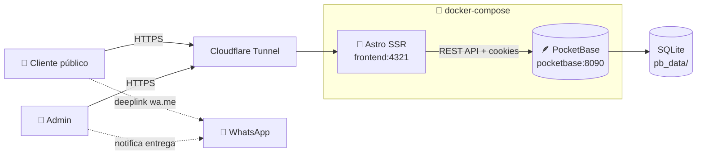
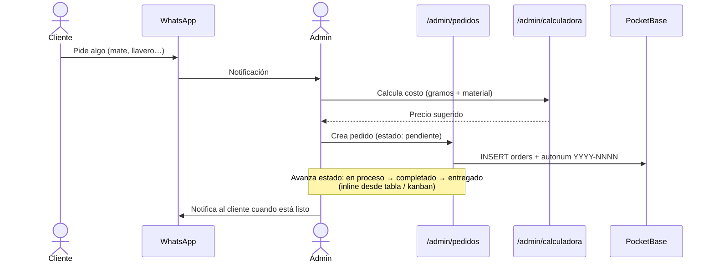
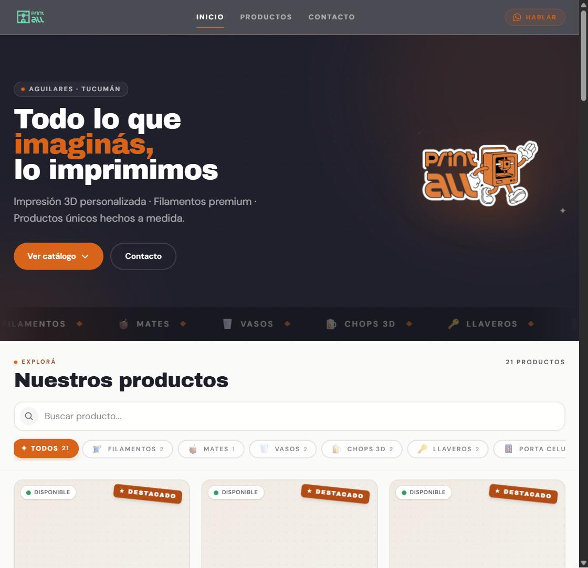
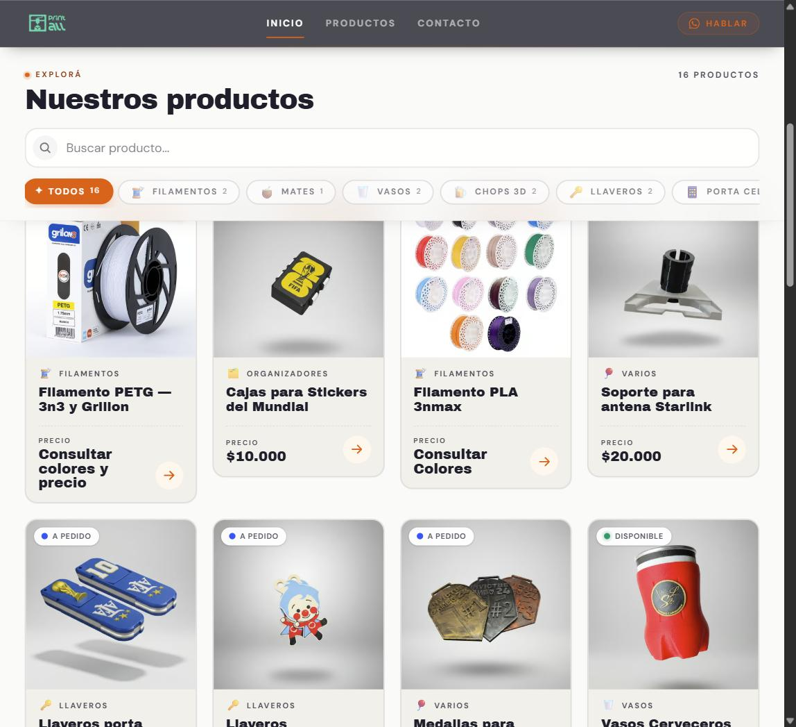
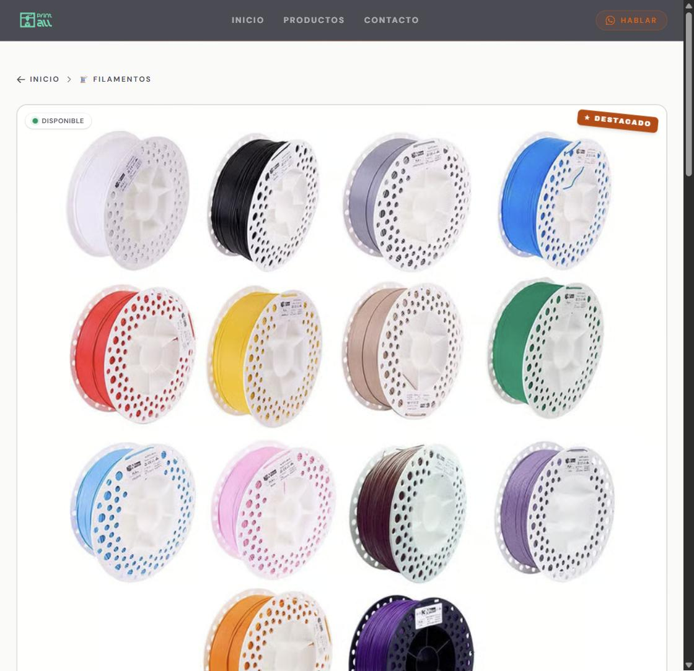

<div align="center">


# Print All

**Catálogo online + back office completo para un emprendimiento de impresión 3D en Aguilares, Tucumán.**

[](https://astro.build/)
[](https://pocketbase.io/)
[](https://tailwindcss.com/)
[](https://www.typescriptlang.org/)
[](https://docs.docker.com/compose/)

[🌐 Sitio en vivo](https://printall.jmlabs.app) · [📱 Instagram](https://www.instagram.com/printall.tuc/)

</div>

---

## Qué es esto

Print All vende productos impresos en 3D (mates, vasos, llaveros, organizadores) y filamentos. Este repo tiene **dos productos** en el mismo proyecto:

- **Catálogo público** (`/`) — vidriera para clientes. Listado de productos por categoría, detalle con galería, CTA directo a WhatsApp para hacer un pedido. Sin carrito ni pagos.
- **Back office admin** (`/admin/*`) — panel completo para gestionar productos, categorías, **pedidos**, **catálogo de materiales con precios costo/venta** y una **calculadora de costos** de impresión.

---

## Features

### Catálogo público

| | |
|---|---|
| 🛒 Catálogo por categorías | Productos heterogéneos (filamentos, mates, llaveros…) con atributos custom por producto |
| 🖼️ Galería de hasta 16 imágenes | Thumbnails optimizados vía Cloudflare Image Resizing |
| 💬 CTA WhatsApp con mensaje pre-armado | El cliente abre WhatsApp con el nombre del producto ya escrito |
| 📱 PWA-friendly | Mobile-first, instalable como app |
| 🔍 SEO + Open Graph | Generación dinámica de OG images con Satori (`/og/producto/[slug].png`) |
| 🌐 Sitemap XML | Auto-generado |

### Back office admin

| | |
|---|---|
| 📋 Productos | CRUD con drag-drop de imágenes, atributos editables inline, filtros y paginación |
| 📂 Categorías | CRUD con reordenamiento drag-drop |
| 📝 **Pedidos** | Schema 3D-printing-aware (material, color, prioridad, avance), 3 vistas: tabla / kanban / calendario, edición inline desde la tabla, cambio de estado con un click |
| 🧪 **Materiales** | Catálogo con `cost_price` / `sell_price` separados, margen calculado en vivo. Para filamentos y componentes |
| 🧮 **Calculadora de costos** | Calcula precio sugerido por impresión: `(gramos / 1000) × costo/kg × multiplicador`. El multiplicador del proceso es ajustable y se persiste en localStorage |
| 🔐 Auth con cookie httpOnly | Sesión PocketBase superuser, middleware que protege `/admin/*` |
| 📱 Responsive | Navbar mobile + paneles adaptados |

---

## Stack

| Capa | Tecnología |
|---|---|
| Frontend | **Astro 5** (SSR Node adapter) + TypeScript estricto + Tailwind 4 (vite plugin) |
| Backend | **PocketBase** embebido en Docker (SQLite + admin UI built-in) |
| UI | Astro components — sin React/Vue/Svelte islands. Drag-drop con `sortablejs` |
| Imágenes | Cloudflare Image Resizing (`/cdn-cgi/image/...`) |
| Deploy | Docker Compose en homelab + Cloudflare Tunnel |
| Dominio | `printall.jmlabs.app` (frontend) · `printall-api.jmlabs.app` (PocketBase) |

---

## Arquitectura



- **Frontend Astro** corre en SSR (Node adapter). Renderiza tanto el catálogo público como las páginas del admin.
- **PocketBase** maneja schema (migrations as code en `pb_migrations/`), auth, files, hooks JS y la SQLite embebida.
- **Cloudflare Tunnel** expone los dos servicios sin abrir puertos al router.

---

## Flujo de un pedido



---

## Capturas

### Catálogo público





### Back office


> ℹ️ Las capturas todavía están pendientes de subir — ver [`docs/screenshots/README.md`](./docs/screenshots/README.md) para la lista completa con dimensiones sugeridas.

---

## Quick start

Requiere **Docker** + **Docker Compose**.

```bash
git clone https://github.com/Josemiranda989/printall.git
cd printall
docker compose up -d --build
```

Servicios:

- 🌐 **Catálogo público**: <http://localhost:4321>
- 🔐 **Admin de la app**: <http://localhost:4321/admin/login>
- 🪶 **Admin nativo de PocketBase** (DB / collections / superusers): <http://localhost:8090/_/>

**Primer arranque**: PocketBase pide crear un superuser al entrar a `/_/`. Usá ese mismo superuser para loguearte en `/admin/login`.

### Aplicar cambios

| Cambio | Comando |
|---|---|
| Código de Astro (componentes, páginas, libs) | `docker compose up -d --build` (rebuildea la imagen del frontend) |
| Migrations PocketBase (`pb_migrations/*.js`) | `docker compose restart pocketbase` (PB las aplica al arrancar) |
| Hooks PocketBase (`pb_hooks/*.pb.js`) | `docker compose restart pocketbase` |

---

## Estructura del proyecto

```
printall/
├── docker-compose.yml
├── frontend/                       # Astro app (SSR, Node adapter)
│   ├── src/
│   │   ├── pages/
│   │   │   ├── index.astro         # Home pública
│   │   │   ├── productos/          # Catálogo público
│   │   │   ├── contacto.astro
│   │   │   ├── og/                 # OG image generation
│   │   │   └── admin/
│   │   │       ├── productos/      # CRUD productos
│   │   │       ├── categorias/     # CRUD categorías
│   │   │       ├── pedidos/        # CRUD pedidos + tabla / kanban / calendario
│   │   │       ├── materiales/     # CRUD materiales (costo + venta)
│   │   │       ├── calculadora.astro
│   │   │       └── api/            # Endpoints REST internos del admin
│   │   ├── components/
│   │   │   └── admin/              # Forms, tables, editors específicos del admin
│   │   ├── layouts/
│   │   ├── lib/                    # admin-products, admin-orders, admin-materials, etc.
│   │   └── middleware.ts           # Auth gate para /admin/*
│   ├── public/
│   │   └── logo.png
│   └── package.json
├── pocketbase/
│   ├── pb_data/                    # ⚠️ gitignored — SQLite + uploads (datos reales)
│   ├── pb_migrations/              # ✅ versionado — schema as code
│   │   ├── 1745784000_create_categories.js
│   │   ├── 1745784001_create_products.js
│   │   ├── 1778100000_create_orders.js
│   │   ├── 1778100100_create_materials.js
│   │   └── …
│   └── pb_hooks/                   # ✅ versionado — hooks JS (autonum de pedidos, etc.)
│       ├── products.pb.js
│       └── orders.pb.js
└── docs/
    └── screenshots/                # Capturas referenciadas desde el README
```

---

## Convenciones del proyecto

### Datos

- `pb_migrations/` se versiona en git — es el **schema as code**. Cualquier cambio de schema va por una migration.
- `pb_data/` **NUNCA** se commitea. Tiene la SQLite con datos reales de clientes y los uploads.
- Productos heterogéneos (filamentos, vasos, llaveros, mates) usan una collection `product_attributes` relacionada para no inflar el modelo de productos.
- Pedidos usan formato `YYYY-NNNN` autogenerado por hook (ej `2026-0001`). Hay UNIQUE INDEX en `order_number`.

### Materiales y costos

- Cada material tiene `cost_price` (lo que pagás al proveedor) + `sell_price` (lo que cobrás).
- El `multiplicador del proceso` (×5 default) NO vive en el material — es un parámetro de la calculadora persistido en localStorage. Cubre errores, luz, tiempo y desgaste de máquina.
- Filamentos: la calculadora usa `(gramos / 1000) × cost_price × multiplicador`.
- Componentes (argollas, vasos, pegamento, bolsas): la calculadora suma `cantidad × sell_price` directo.

### Imágenes

- Hasta **16 imágenes** por producto, máx 5MB cada una. Formatos: JPEG, PNG, WebP.
- Servidor genera 3 thumbnails (`120×120`, `400×400`, `800×800`) vía Cloudflare Image Resizing.

### Patrones técnicos

- **PocketBase JSVM hooks**: las funciones helper definidas en el top-level del archivo `pb_hooks/*.pb.js` NO son visibles dentro del callback (corre en pool de Goja runtimes separado). Toda la lógica del hook tiene que vivir **inline** dentro del callback. Sin esto, falla con `ReferenceError`.
- **Validación**: cada form tiene validación server-side en `lib/admin-*.ts` (extractor) y client-side mínima como UX. La server-side es la fuente de verdad.
- **Sin React/Vue islands**: scripts vanilla TS dentro de los `<script>` de Astro components. Drag-drop con `sortablejs`.

---

## Categorías iniciales del catálogo

Alineadas con los highlights de Instagram: Filamentos, Mates, Vasos, Llaveros, Porta celulares, Chops 3D, Organizadores, Insumos.

---

## Licencia

Proyecto privado. Código propietario de Print All / JMLabs.
